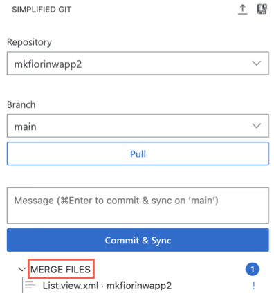
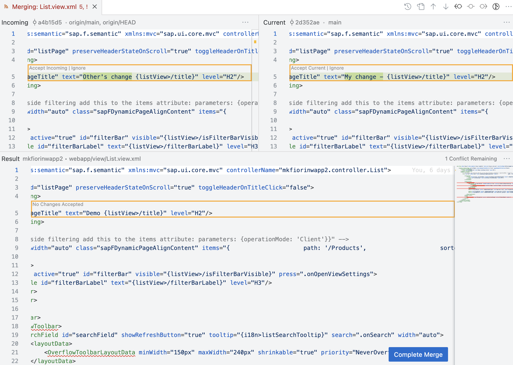

<!-- loio52c441b50107422d9723ccb4d1b6dcf3 -->

# Resolve Conflicts in the Simplified Git View

Merge operations can fail because of conflicts between the current branch and the branch from which you choose to incorporate the changes. You can resolve merge conflicts using the *SIMPLIFIED GIT* view.

1.  When there are conflicts, the *MERGE FILES* section is displayed.

    

2.  Click one of files to resolve the conflict.

    A split view is displayed.

    

3.  Choose one of the following options to resolve the merge conflict:
    -   *Accept Current Change*: Apply the selected line of change from the current branch.
    -   *Accept Incoming Change*: Apply the selected line of change from the remote branch.
    -   *Ignore*: Ignore the selected line of change.
    -   *Complete Merge*: Open the *SOURCE CONTROL* view to complete the merge. Only choose this option if you want to use the *SOURCE CONTROL* view.

4.  Enter a message describing your changes and click *Commit & Sync* to complete the conflict resolution and sync your changes to the remote repository.

