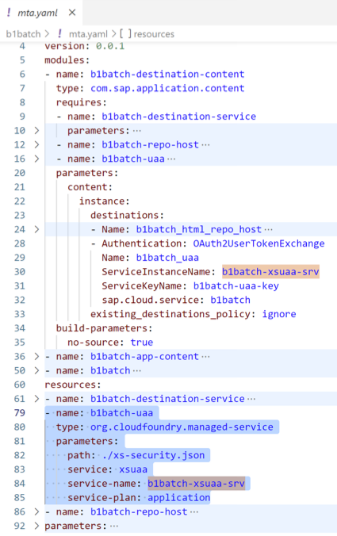

<!-- loio5b489fe51a494ae2a6b34d8a875d5d95 -->

# Running Deployed HTML5 App

Steps you can take if you have trouble running your deployed HTML5 application.

<a name="loio5b489fe51a494ae2a6b34d8a875d5d95__section_c2s_wmq_fdc"/>

## HTML5 App Fails to Run from SAP BTP Cockpit

**Problem**

When trying to run a deployed HTML5 application from SAP BTP, the app fails to run and there is no response.

**Solution**

Check that the `welcomeFile` is defined in the HTML5 application's `xs-app.json` file.

<a name="loio5b489fe51a494ae2a6b34d8a875d5d95__section_gzd_lzm_gdc"/>

## HTML5 App Fails to Run from SAP Build Work Zone

**Problem**

The deployed HTML5 application runs from the SAP BTP cockpit, but the app fails to run from SAP Build Work Zone.

**Solution**

Make sure that the `sap.cloud.service` value in the HTML5 application's `mta.yaml` and `manifest.json` files match.

<a name="loio5b489fe51a494ae2a6b34d8a875d5d95__section_alj_y1n_gdc"/>

## HTML5 App Isn't Displayed in the SAP BTP Cockpit

**Problem**

The deployed HTML5 application isn't displayed in the list of HTML5 Applications in the SAP BTP cockpit.

**Solution**

Make sure to check the following in the `mta.yaml` file:

-   You used the SAP managed approuter procedure when creating the MTA.
-   If the destination deployer module is defined on the instance level, check that the destination resource configuration contains the `HTML5_runtime_enabled = true` property.
-   The `html5-apps-repo/app-host` instance exists.

If it doesn't exist, check the warnings in the list of *HTML5 Applications* in the SAP BTP cockpit.

Delete the destination instance and redeploy the MTA to create the destination instance pointing to the new app-host instance from scratch.

<a name="loio5b489fe51a494ae2a6b34d8a875d5d95__section_xsw_22n_gdc"/>

## Running the HTML5 App Shows an XSUAA Error

**Problem**

The deployed HTML5 application fails to run. In the *HTML5 Applications* list in the SAP BTP cockpit, the following error \(or similar\) is displayed:

`Failed to exchange XSUAA token by service token.`

**Solution**

Make sure to check that the XSUAA instance pointed to by the destination configuration really exists in the `mta.yaml` file.

Sometimes, the XSUAA instance gets deleted accidentally.

If the XSUAA instance doesn't exist, delete the destination and redeploy the MTA to create the destination instance pointing to the new XSUAA instance from scratch.

