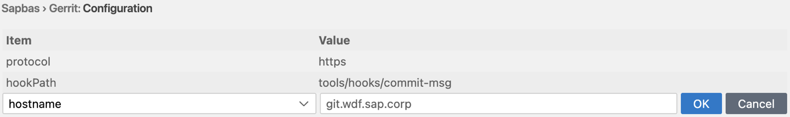
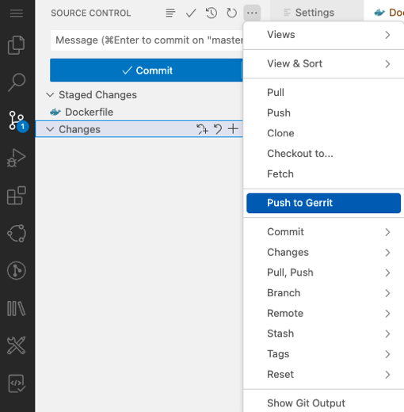

<!-- loio82a5dfe9ca364bd69bec281fdb87aba6 -->

# Setting Up Git to Work with Gerrit

Gerrit is a web-based software code review tool for reviewing, approving, or rejecting changes to the source code developed by your colleagues. Gerrit works as an intermediate environment for source control between the local environment and the remote Git repository.

<a name="loio82a5dfe9ca364bd69bec281fdb87aba6__section_a5c_qhs_xrb"/>

## Prerequisite

You configured the required Cloud Connector and destination in your account.

## Procedure

1.  Enable Gerrit:
    1.  Navigate to *File* \> *Preferences* \> *Settings*.
    2.  From the list of preferences, under *Extensions*, click *Sapbas*.
    3.  Under **Gerrit: Enabled**, select the *Whether gerrit is enabled* checkbox.
    4.  Under **Gerrit: Configuration**, click *Add Item* and add the required properties \(*hookPath*, *protocol*, and *hostname*\) and their values, which can be obtained from your organization's Gerrit administrator.

        This is the configuration for SAP WDF Gerrit system:

        

2.  Clone your project. See [Cloning Repositories](cloning-repositories-7a68bfa.md).
3.  Perform your change and create a commit. See [Commit \(Amend\) Changes](commit-amend-changes-460ff49.md).
4.  From the *SOURCE CONTROL* view menu, click More Actions.

    

5.  Select *Push to Gerrit*.

    

**Related Information**  

[Cloud Connector](https://help.sap.com/viewer/cca91383641e40ffbe03bdc78f00f681/Cloud/en-US/e6c7616abb5710148cfcf3e75d96d596.html)

[Install the cloud connector](https://developers.sap.com/tutorials/hana-cloud-mission-extend-08.html#9e28ce44-889d-4d6c-a0ff-ac406eb21c05)

[Configure Systems in Cloud Connector](https://developers.sap.com/tutorials/btp-app-ext-service-cloud-connector.html)

