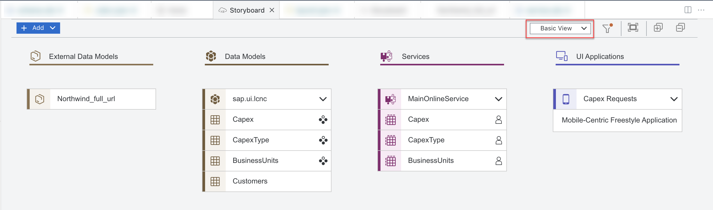
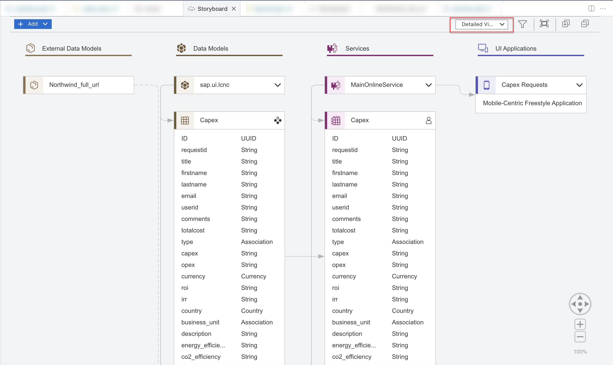
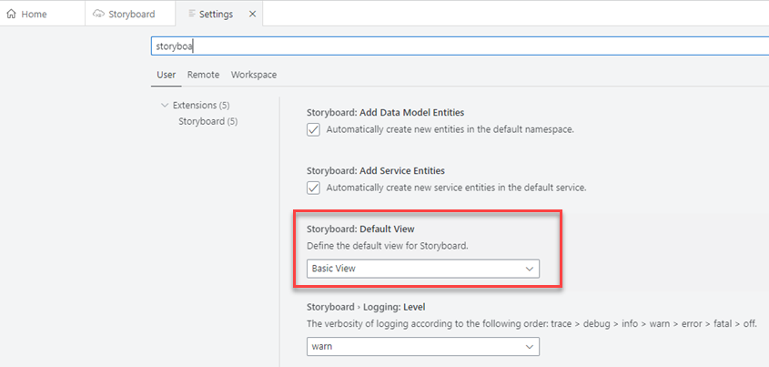
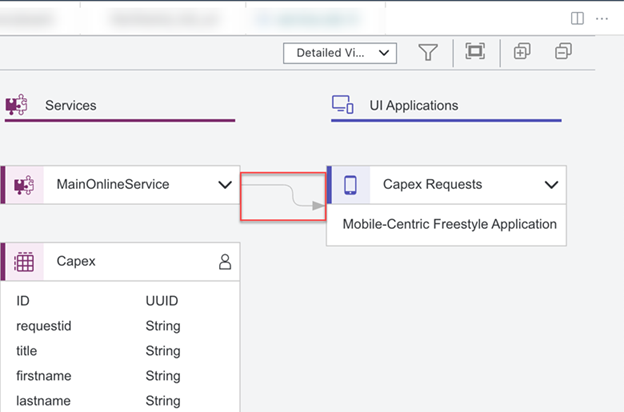

<!-- loio6ca29416156647d3ad170d5004c9e782 -->

# Storyboard

The Storyboard allows you to develop applications using graphical editors and wizards.

From the Storyboard you can trigger the graphical editors as well as other tools required to develop your application.

The Storyboard provides a graphical view of an application's data models, external data models, services, and UI front ends of the application, as well as the connections between them. This allows for a quick understanding of the application’s structure and components.

You can move, zoom in and out, and expand and collapse a single component, or all components at once. You can also select a single component and edit its properties in its graphical modeler.

You can filter objects to focus on the application components that are relevant for you.

You can customize the view to show all of the component's connectors and properties, or to show only the component names.

-   To see only the component names, select *Basic View* from the dropdown list.

    

-   To see the component together with its connectors and properties, select *Detailed View* from the dropdown list.

    

By default, the Storyboard opens showing the *Basic View*. You can change the default to the *Detailed View* in the *Settings* view.

 

<a name="loio6ca29416156647d3ad170d5004c9e782__section_tkt_kch_mwb"/>

## Working in the Storyboard

To open the Storyboard:

1.  In the *Project Explorer*, expand your project and select *Storyboard*.

1.  Press [F1\] to open the command palette.
2.  Enter ***Storyboard***.
3.  Select *Open Storyboard*.
4.  Select the project for which you want to open the Storyboard.

<a name="loio6ca29416156647d3ad170d5004c9e782__section_jvn_bjh_mwb"/>

## Data Models

Under *Data Models*, you can see the namespace and below it the data model entities. Entities that are a projection of an external data model also appear under *Data Models* with a dotted-line connection to the external system.

You can add sample data to a data model entity.

1.  Right-click on the entity.
2.  From the context menu, choose if you want to add new sample data or import existing data. The *Sample Data Editor* opens.
3.  Add the relevant information in the *Sample Data Editor*.

    Sample data is added to the entity and is marked with the  \(Sample Data\) icon,

4.  Click the  \(Sample Data\) icon to open the editor and change the data.

<a name="loio6ca29416156647d3ad170d5004c9e782__section_wwy_mch_mwb"/>

## External Data Models

Under *External Data Models*, you can see the external services used in the project, with a dotted-line connection to the relevant data model entity \(under *Data Models*\) or service entity \(under *Services*\).

To see all of the external service's entities and properties, right-click on the service name and click *Open in Graphical Modeler*.

<a name="loio6ca29416156647d3ad170d5004c9e782__section_c55_mch_mwb"/>

## Services

Under *Services*, you can see the service entities used in the project.

You can add user roles to the service or to the entities under it.

1.  Right-click on the service or entity to which you want to add a role.
2.  Select *Define Role*.
3.  In the *Authorization* editor that opens, set the relevant roles.

    The roles are assigned to the entity or service and are marked with the  \(User Role\) icon,

4.  Click the  \(User Role\) icon to open the editor and change the data.

<a name="loio6ca29416156647d3ad170d5004c9e782__section_gwn_mch_mwb"/>

## UI Applications

Under *UI Applications*, you can see SAP Fiori or mobile applications.

For SAP Fiori applications, see the application template used in the project.

For both SAP Fiori and mobile apps, the storyboard shows the connection between the service and the UI that it's exposing externally.

****

### To create a new UI application:

Select *UI Application* from the *Add* dropdown list in the upper-left corner of the view.

A generator opens based on the type of application you want to create.

