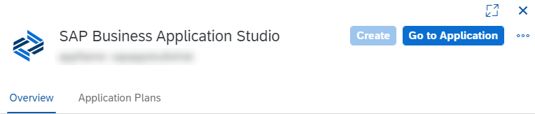

<!-- loio6331319fd9ea4f0ea5331e21df329539 -->

# Subscribe to SAP Business Application Studio

Before you can work in SAP Business Application Studio, the account administrator must subscribe the subaccount to the SAP Business Application Studio application.

<a name="loio6331319fd9ea4f0ea5331e21df329539__section_vdm_nmz_tkb"/>

## Prerequisites

-   If your global account uses the subscription-based commercial model, then you must have bought a SaaS license for SAP Business Application Studio. See [Pricing and Packaging](https://discovery-center.cloud.sap/#/serviceCatalog/business-application-studio?region=all&tab=service_plan). You can also contact us on [SAP BTP](https://cloudplatform.sap.com/index.html) or via an SAP sales representative.

-   You've created a subaccount in Cloud Foundry. See [Create a Subaccount](https://help.sap.com/products/BTP/65de2977205c403bbc107264b8eccf4b/05280a123d3044ae97457a25b3013918.html).

-   You're an administrator of the subaccount.

<a name="loio6331319fd9ea4f0ea5331e21df329539__section_ajs_4mz_tkb"/>

## Procedure

1.  Open your global account in the cockpit.
2.  Go to your subaccount.
3.  In the navigation area, choose *Services* \> *Service Marketplace*.

    You can see a list of the applications to which your global account is entitled in the Cloud Foundry environment.

    > ### Note:  
    > The *Instances and Subscriptions* page displays all subscriptions and instances in your subaccount.

4.  Search for ***Studio***. The SAP Business Application Studio tile appears.

    > ### Note:  
    > If you don't see the SAP Business Application Studio tile in the results, check the entitlement configuration for your subaccount. See [Configure Entitlements and Quotas for Subaccounts](https://help.sap.com/products/BTP/65de2977205c403bbc107264b8eccf4b/5ba357b4fa1e4de4b9fcc4ae771609da.html).

5.  Click the application name to open its *Overview* page.
6.  Click *Create*.
7.  From the *New Instance or Subscription* dialog box, select the relevant application plan. For information on the difference between the plans, see [Application Plans](application-plans-2c72917.md).
8.  Click *Create*.
9.  From the *Creation in Progress* dialog box, click *View Subscription*.
10. Grant user permissions to work with SAP Business Application Studio. See [Manage Authorizations and Roles](manage-authorizations-and-roles-01e69c5.md).
11. From the SAP Business Application Studio *Overview* page in the cockpit, click *Go to Application*.

    

> ### Note:  
> To remove a subscribed application, go to the *Instances and Subscriptions* page, click the ellipsis at the end of the subscription row, and then click *Delete*. This action deletes all data related to the application in the respective subaccount.

