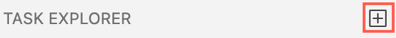
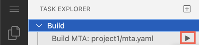
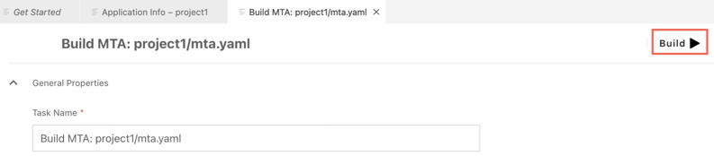

<!-- loio1232c72da9c3466a849ec7b9da89866a -->

# Task Explorer

You can create, modify, and run tasks for specific SAP scenarios.

> ### Note:  
> This feature is only available when the dev space extensions provide scenario-specific tasks.

The Task Explorer allows you to create and edit scenario-specific tasks using a dedicated user interface. You can store your configurations and reuse them.

1.  From the left sidebar, click  to open the *Task Explorer* view.
2.  Click *\+*.

    

    **The *Create Task* page is displayed showing only tasks that are relevant to the projects in your workspace.** 

    Tasks are grouped according to the user intent.

3.  Click *Configure*. The task is created in the `tasks.json` file and is visible in the *Task Explorer* view.
4.  Right-click on a task to edit its properties or to delete it if necessary.
5.  Save your changes.
6.  Run the task by clicking the Run icon next to the task in the *Task Explorer*

    

    or by clicking the button at the top-right corner of the Edit Task view.

    

**Related Information**  

[Building and Deploying Multitarget Applications](building-and-deploying-multitarget-applications-97ef204.md "Build and deploy multitarget applications to SAP Cloud Foundry.")

