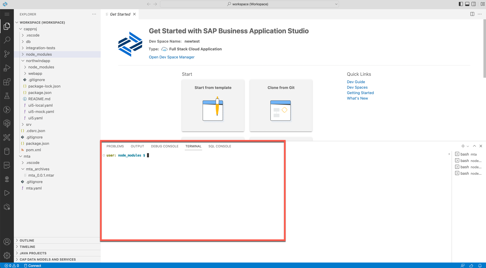

<!-- loioc8b4ae95701942a5a21be4e84749f97f -->

# Terminal

Opening the integrated terminal allows you to access the underlying system. The terminal is a convenient tool because you don't need to switch windows or change the state of an existing terminal to perform a quick command-line task.

You can create multiple terminals open to different locations and easily navigate between them.

With access to the terminal, you can use any tool that is pre-installed on your dev space, such as maven and npm. You can install additional tools, including global npm packages and other CLIs, using npm install. You can execute commands from the command line, create new projects or modules, build applications, and deploy applications from the terminal.

From the left-side menu, select *Terminal* \> *New Terminal* to open the terminal.

To open the terminal at a specific directory, right-click the desired file in the *File Explorer*, and select *Open in Integrated Terminal*.

**Related Information**  

[Create an SAPUI5 App from the Command Line](https://developers.sap.com/tutorials/cp-cf-sapui5-local.html)

