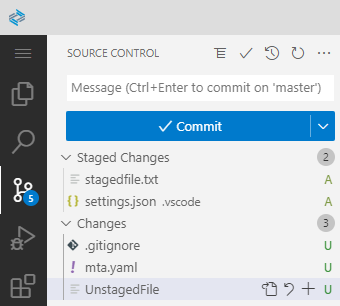
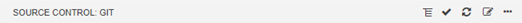
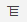
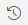
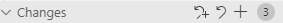

<!-- loio265962e20eee43f499516de9011ac2e3 -->

# Using the Git View

General overview of the Git view in SAP Business Application Studio.

SAP Business Application Studio provides a graphical user interface for executing Git commands and managing your source control and versioning. You can also manually perform other Git commands from the terminal.

<a name="loio265962e20eee43f499516de9011ac2e3__section_wlx_4kf_zlb"/>

## Git View

To open the Git view, click  from the activity bar.

The Git view is divided into the following sections:

*SOURCE CONTROL* view menu

 

-   Click  to toggle between list and tree views.
-   Click  \(or press  [<Ctrl\>\] + [<Enter\>\] \) to commit the changes.
-   Click  to refresh the Git pane.
-   Click  to view the Git history.
-   Click  to see more available actions. See [Git Commands](git-commands-5914548.md)

 *Message* section

Enter a description for the commit.

*Staged Changes* section

Shows the files that will be included in the next commit.

Hover over the section title to see additional actions.

-   Click  to unstage all files in the section.

Hover over the files in this section to see additional actions:

-   Click  to unstage the changes in the file.
-   Click  to open the file.

*Changes* section

Shows the files that contain changes.

Hover over the section title to see additional actions.

-   Click  to discard all changes.
-   Click  to stage all changes.

Hover over the files in this section to see additional actions:

-   Click  to discard the changes in the file.
-   Click  to open the file.
-   Click  to stage the changes in the file.

*Amend* section.

Click *Amend* at the bottom of the pane to make changes to a commit.

<a name="loio265962e20eee43f499516de9011ac2e3__section_rqf_jtf_zlb"/>

## Git Status Bar

At the bottom-left corner of SAP Business Application Studio, you can find indicators describing the status of your Git repository. They show the current branch, dirty indicators, and the number of ahead and behind changes of the current branch.

The dirty indicators are as follows:

*\**: You have unstaged changes in your branch.

*\+*: You have staged changes in your branch, but no unstaged changes.

*!*: You have conflicting changes in your branch.

Clicking on the branch name, opens the command palette showing additional Git commands.

There is also a *Synchronize Changes* action in the status bar, next to the branch indicator, if the currently checked-out branch has an upstream branch configured. Clicking *Synchronize Changes* opens the command palette showing additional Git commands that can be applied to the branch.

<a name="loio265962e20eee43f499516de9011ac2e3__section_gl5_q1g_zlb"/>

## Branches

You can create and check out branches directly within the IDE by using the ***Git: Checkout*** command in the command palette.

To create a new branch:

1.  Click on the active branch name in the status bar. The command palette opens.
2.  Enter a name for the new branch. A new branch is created and checked out.

<a name="loio265962e20eee43f499516de9011ac2e3__section_trx_bbg_zlb"/>

## Gutter Indicators

If you open a folder that is a Git repository and begin making changes, annotations are added to the gutter and to the overview ruler.

-   A red triangle indicates where lines have been deleted.

-   A green bar indicates new added lines.

-   A blue bar indicates modified lines.

-   **[Git Commands](git-commands-5914548.md "SAP Business Application Studio supports Git
		commands from the Git view and from the command palette.")**  
SAP Business Application Studio supports Git commands from the Git view and from the command palette.

